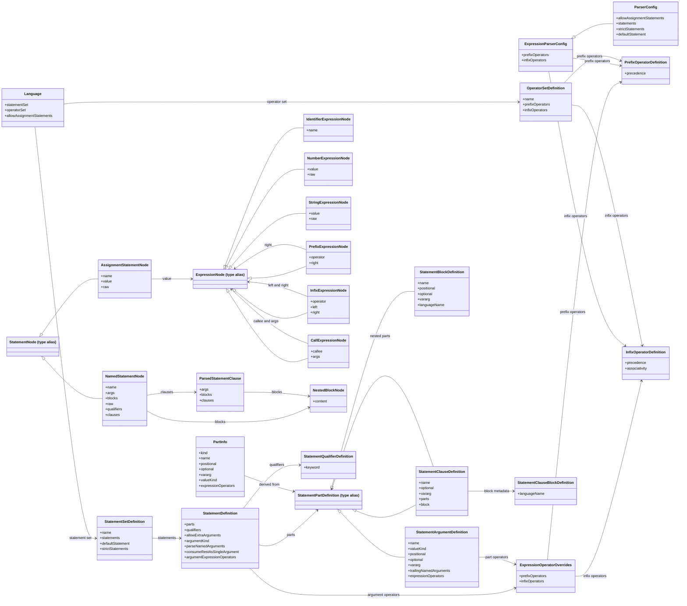

# Parser Reference

This directory provides reusable expression and statement parsing for line-based languages. It owns parser configuration, AST node types, and language-composition helpers. It does not define shell commands or execution behavior.

The parser scans source internally, so most callers work with parser configs and AST nodes rather than token streams.

## Public API

`parser/index.ts` re-exports three parser-owned surfaces:

- `expression.ts`: expression AST nodes and operator configuration
- `statement.ts`: statement AST nodes, parser entry points, and statement-shape definitions
- `language.ts`: reusable named operator sets, statement sets, and parser scopes

## Core entry point

Use `createParser(config)` to build a reusable parser instance.

The returned `GenericParser` exposes:

- `parseLine(line, startLine?, scope?)`
- `parseScript(input, scope?)`

`scope` is an optional `Language` override for a single parse call. This lets a host keep one parser instance while switching statement and operator definitions for nested blocks or user-selected languages.

## Parser configuration

`ParserConfig` extends `ExpressionParserConfig` with statement parsing rules:

- `allowAssignmentStatements`: parse `name = expression` as `AssignmentStatementNode`
- `statements`: mapping from statement name to `StatementDefinition`
- `strictStatements`: reject unknown statement names instead of falling back
- `defaultStatement`: statement definition used when a named statement does not have an explicit entry

At the expression level, operator behavior comes from:

- `PrefixOperatorDefinition`
- `InfixOperatorDefinition`
- `ExpressionOperatorOverrides`
- `ExpressionParserConfig`

## Statement definitions

`StatementDefinition` describes how one statement is parsed.

The main extension point is `parts`, which can contain:

- `StatementArgumentDefinition`
- `StatementBlockDefinition`
- `StatementClauseDefinition`

Together those parts support:

- positional, optional, and vararg arguments
- expression-valued or raw-string arguments
- named blocks and repeated blocks
- qualifiers
- keyed clauses with nested clauses
- clause-bound blocks
- per-statement or per-argument operator overrides

`StatementDefinition` also carries parser behavior switches:

- `allowExtraArguments`
- `argumentKind`
- `parseNamedArguments`
- `consumeRestAsSingleArgument`
- `argumentExpressionOperators`

## Parsed output

Statement parsing returns `StatementNode`, which is one of:

- `NamedStatementNode`
- `AssignmentStatementNode`

`NamedStatementNode` contains:

- `name`: resolved statement name
- `args`: parsed argument values
- `blocks`: parsed nested block values
- `clauses`: parsed keyed-clause occurrences
- `qualifiers`: qualifier flags resolved to booleans
- `raw`: original source line

Argument and clause values are represented as:

- `ExpressionNode` for parsed expressions
- `string` for raw argument capture
- `NestedBlockNode` for balanced `{ ... }` source blocks

`NestedBlockNode` intentionally preserves block source as text so a host can parse or execute that block later with another `Language`.

## Language composition

`language.ts` provides reusable parser building blocks:

- `OperatorSetDefinition`
- `StatementSetDefinition`
- `Language`
- `createLanguage(...)`
- `toExpressionParserConfig(...)`
- `toStatementParserDefinition(...)`
- `toParserConfig(...)`

A host can compose an operator set and a statement set into a `Language`, then either:

- build a parser once with `createParser(toParserConfig(language))`
- pass a `Language` to `parseLine` or `parseScript` as a per-call override

Registry helpers are also exported:

- `resolveNamedOperatorSet(registry, name)`
- `resolveNamedStatementSet(registry, name)`
- `resolveNamedLanguage(registry, name)`

Those helpers clone caller-owned definitions when they resolve them, which makes registry reuse safer when hosts allow runtime mutation.

## Utility helpers

Two parser-owned helpers are useful for higher-level runtimes layered on top of the AST:

- `extractNestedBlock(source, fromIndex?)`: find a balanced `{ ... }` region and return its content plus source indexes
- `getStatementArgumentSource(line)`: strip the leading statement name and return the remainder of the source line

## Class diagram

This diagram is structural rather than exhaustive. It uses `ExpressionNode`, `StatementNode`, and `StatementPartDefinition` as conceptual hubs for the exported union types, then shows the concrete classes that hang off those hubs.



## Minimal example

```ts
import {
	createLanguage,
	createParser,
	InfixOperatorDefinition,
	OperatorSetDefinition,
	PrefixOperatorDefinition,
	StatementArgumentDefinition,
	StatementDefinition,
	StatementSetDefinition,
	toParserConfig
} from "./parser/index.js";

const operatorSet = new OperatorSetDefinition({
	prefixOperators: {
		"-": new PrefixOperatorDefinition(9)
	},
	infixOperators: {
		"+": new InfixOperatorDefinition(5, "left")
	}
});

const statementSet = new StatementSetDefinition({
	statements: {
		emit: new StatementDefinition({
			parts: [
				new StatementArgumentDefinition({
					name: "value",
					valueKind: "expression",
					positional: true
				})
			]
		})
	},
	strictStatements: true
});

const language = createLanguage({ statementSet, operatorSet });
const parser = createParser(toParserConfig(language));

const statement = parser.parseLine("emit 1 + 2");
```

In that example, `statement` is a `NamedStatementNode` whose `args.value` is a parsed expression tree.
